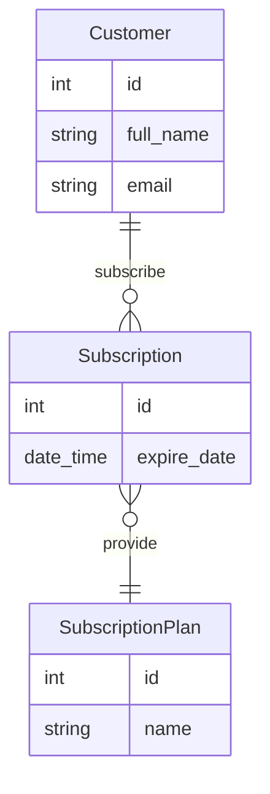

# Subscription manager
Example of CLI application written in Go following Domain Driven Design

## Supported use cases
- As a salesman, I want to be able to create a new customer entities
- As a salesman, I want to be able to list all cataloged customer entities
- As a salesman, I want to be able to get detailed information about customer entity
- As a salesman, I want to be able to update information about customer entity
- As a salesman, I want to be able to delete customer entity, with all associated subscriptions
---
- As a salesman, I want to be able to add new subscription plans
- As a salesman, I want to be able to list all subscription plans
- As a salesman, I want to be able to get detailed information about subscription plan
plans
- As a salesman, I want to be able to update information about subscription plan
- As a salesman, I want to be able to withdraw subscription plan from the offer
---
- As a salesman, I want to be able to register new subscriptions
- As a salesman, I want to be able to list all subscriptions
- As a salesman, I want to be able to get detailed information about subscription
- As a salesman, I want to be able to renew subscription
- As a salesman, I want to be able to expire subscription

## Data class diagram
